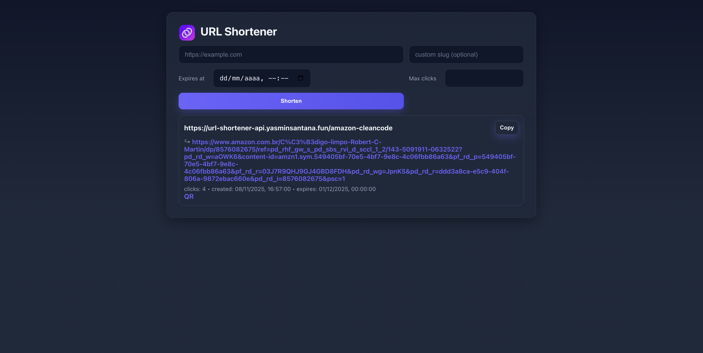
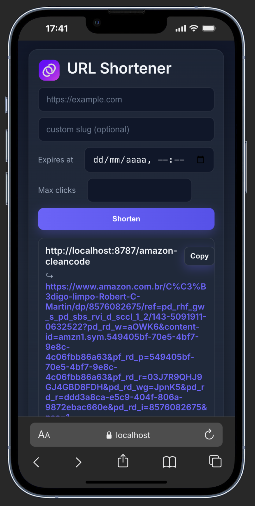

# 🌐 Interface Web do Encurtador de URLs

Interface moderna e responsiva para o serviço de encurtamento de URLs, desenvolvida com **React**, **TypeScript** e **Vite**.

<div align="center">
  
</div>

---

## ✨ Funcionalidades

- 🔗 Crie URLs curtas instantaneamente  
- ⏱️ Defina data de expiração para os links  
- 🔢 Configure o número máximo de cliques  
- 📊 Acompanhe estatísticas de acesso  
- 📱 Design totalmente responsivo (*mobile-first*)  
- 📷 Gere códigos QR automaticamente para os links  

---

## 🚀 Tecnologias e Versões

| Badge                                                                                                                                   | Descrição                                  |
| :-------------------------------------------------------------------------------------------------------------------------------------- | :----------------------------------------- |
| [](https://react.dev/)                               | Biblioteca principal da interface.          |
| [](https://www.typescriptlang.org/)     | Tipagem estática e melhor manutenção.      |
| [](https://vitejs.dev/)                                 | Ferramenta de build rápida e moderna.      |
| [](https://bun.sh/)                                    | Runtime JavaScript rápido e eficiente.     |
| [](https://developer.mozilla.org/docs/Web/CSS)     | Estilização e temas com variáveis CSS.     |
| [](https://www.npmjs.com/package/qrcode) | Geração de QR Codes para os links.         |

---

## 🧩 Estrutura do Projeto

```
web/
├── src/
│   ├── components/     # React components
│   │   ├── CreateForm.tsx
│   │   ├── UrlList.tsx
│   │   └── CopyButton.tsx
│   ├── api.ts         # API client setup
│   ├── App.tsx        # Main app component
│   ├── main.tsx       # App entry point
│   └── index.css      # Global styles
├── public/            # Static assets
├── index.html         # HTML template
├── package.json
└── vite.config.ts     # Vite configuration
```


---

## ⚙️ Como Executar

### Pré-requisitos

- Node.js 18+ ou runtime **Bun**  
- Gerenciador de pacotes (**npm**, **yarn** ou **bun**)  

### Instalação

1. Instale as dependências:
```bash
# Usando bun (recomendado)
bun install

# Ou usando npm
npm install

# Ou usando yarn
yarn


2. Configure as variáveis de ambiente:
```bash
# Crie o arquivo .env
cp .env.example .env

# Configure a URL da API (padrão: http://localhost:8787)
VITE_API_BASE=http://localhost:8787
```

### Desenvolvimento

Inicie o servidor de desenvolvimento:

```bash
# Usando bun
bun run dev

# Ou usando npm
npm run dev

# Ou usando yarn
yarn dev
```

The app will be available at `http://localhost:5173`

### Build para Produção

```bash
# Usando bun
bun run build

# Ou usando npm
npm run build

# Ou usando yarn
yarn build
```

## Screenshots

### 💻 Desktop View
<div align="center">  </div>

### 📱 Mobile View
<div align="center">  </div>


## 🔍 Otimização para SEO

- O projeto inclui:
- Metadados otimizados
- Tags Open Graph para compartilhamento
- Design leve e responsivo
- Boas práticas de performance e acessibilidade

## 🤝 Contribuição

Contribuições são bem-vindas! Sinta-se à vontade para abrir issues ou enviar pull requests.

1. Faça um fork do projeto
2. Crie sua branch de feature (`git checkout -b feature/amazing-feature`)
3. Commit suas mudanças (`git commit -m 'Add some amazing feature'`)
4. Push para a branch (`git push origin feature/amazing-feature`)
5. Abra um Pull Request

---

<div align="center">
  <p>Desenvolvido com 💜 por Yasmin Santana</p>

[LinkedIn](https://www.linkedin.com/in/yasmin-santana-santos/) [GitHub](https://github.com/santyasm)
</div>